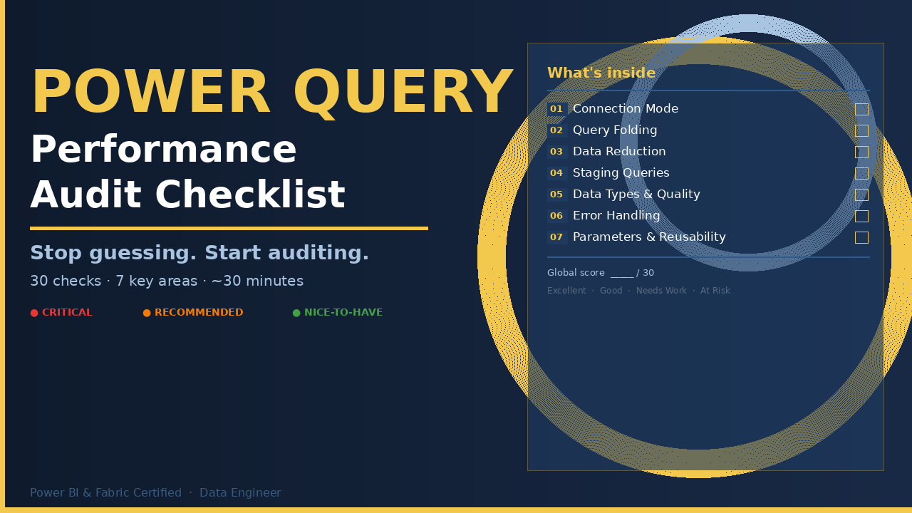
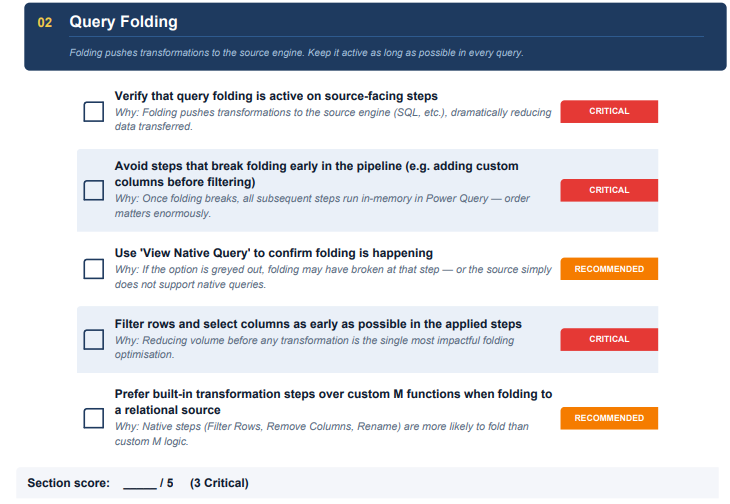

# Power Query Performance Audit Checklist

A practical checklist to audit Power Query models and identify common causes of slow refresh in Power BI and Excel
(query folding, staging queries, data reduction, and transformation patterns).

## Preview

Power Query performance issues often come from small design decisions:
- broken query folding
- unnecessary columns and rows
- duplicated queries
- poor staging patterns
- incorrect data types

This checklist provides a structured way to review a model and quickly identify these problems.

## What the checklist covers

The audit framework contains **30 checks across 7 key areas**:

1. Connection Mode
2. Query Folding
3. Data Reduction
4. Staging Queries & Disabled Load
5. Data Types & Quality
6. Error Handling & Resilience
7. Parameters & Reusability

Each check includes a short explanation of **why it impacts performance**.
Checks are labelled with severity levels (CRITICAL, RECOMMENDED, NICE-TO-HAVE), and each section includes a scoring system.

## Teaser

## Typical use cases

This checklist can be useful when:

- a Power BI report refresh becomes slow
- reviewing a model built by another developer
- auditing a dataset before production deployment
- improving an existing Power Query workflow

## Full checklist

The complete formatted checklist (PDF) is available here:

➡️ https://practicaldata.gumroad.com/l/power-query-performance-checklist

## Author

Sandra Margot  
Power BI & Microsoft Fabric Certified  
Data engineer
